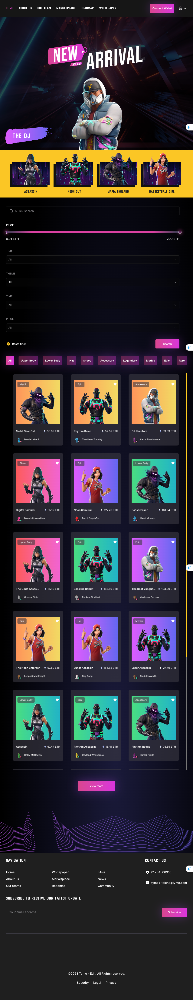

<h1 align="center">
  <br>
  <br>
  TymeX Assignment - Truyen Nguyen
  <br>
</h1>

## 📝 Project Overview
TymeX Assignment is a modern NFT marketplace built with React and TypeScript, featuring a sleek UI, advanced filtering.

- [🚀 Main Features](#-main-features)
- [🛠️ Tech Stack](#-tech-stack)
- [🔧 How To Use](#-how-to-use)
- [📂 Project Structure](#-project-structure)
- [🌍 Live Demo](#-live-demo)
- [📸 Screenshots](#-screenshots)


## 🚀 Main Features
### 🔥 **Must-Have Features**
- **🌟 Modern UI/UX:**
  - **Matches Figma Design accurately** ✅
  - **Smooth hover effects & animations** ✅
  - **Fully responsive** (Desktop, Tablet, Mobile) ✅
- **⚡ NFT Marketplace Functionalities:** 
  - **Search & Filter NFTs** by multiple criteria: ✅
     - 🔍 **NFT Name** 
     - 🎭 **Category (Upper Body, Lower Body, Hat, Shoes, Accessory, Legendary, Mythic, Epic, Rare)** ✅
     - 💰 **Price Range (ETH)** ✅
     - 🕒 **Time** ✅
  - **"View More" Button** to load additional NFTs ✅
  - **Loading effects & API error handling** ✅
  - **Auto-refresh data every 60 seconds** ✅
- **🔧 Code Quality & Best Practices:**  
  - Written in **TypeScript** ✅
  - **Component-based architecture**, breaking down UI elements efficiently ✅
  - Code formatting with **ESLint + Prettier** ✅ 
  - **Test coverage > 40%** ✅ 
### 🌟 **Nice-To-Have Features (Optional)** 
  - **Dynamic Animations**: Smooth hover & transition effects ✅
  - **Lazy Loading & Skeleton UI** when fetching NFTs ✅
  - **Have custom Hooks ( For Reactjs / Nextjs ) and Have Higher-Order Function (HOC)**  ✅
  - **Debounce Search**: Reducing API calls while typing ✅
  - **Test coverage > 80%** ❌  
    - *Statement Coverage:* 93.08%
    - *Branch Coverage:* 88.46%
    - *Function Coverage:* 75.36%
    - *Line Coverage:* 93.08%

  - **Have working demo online**  ✅

## 🛠️ Tech Stack

- **Frontend:** React, TypeScript 
- **UI:** TailwindCSS, shadcn/ui, Framer Motion  
- **Testing:** Vitest + React Testing Library  
- **API Handling:** Axios  


## 🔧 How To Use

### 1️⃣ Install dependencies
```bash
npm install
```

### 2️⃣ Run the development server
```bash
npm run dev
```
The project will be available at `http://localhost:5173/`
### 3️⃣ Run tests

```bash
npm run test
```

### 4️⃣ Run tests coverage

```bash
npm run coverage
```
 ## 📂 Project Structure

 ```bash
.
├── public
│   └── vite.svg
├── src
│   ├── __snapshots__
│   ├── apis
│   ├── assets
│   ├── components
│   ├── constants
│   ├── hocs
│   ├── hooks
│   ├── layouts
│   ├── lib
│   ├── modules
│   ├── pages
│   ├── routes
│   ├── styles
│   ├── types
│   ├── utils
│   ├── App.tsx
│   ├── main.tsx
│   └── vite-env.d.ts
├── README.md
├── eslint.config.js
├── index.html
├── package-lock.json
├── package.json
├── setup.ts
├── tsconfig.app.json
├── tsconfig.json
├── tsconfig.node.json
├── vite.config.ts
└── vitest.config.ts
 ```

 ## 🌍 Live Demo
- **Frontend:** [roy.lolstate.com](https://roy.lolstate.com/)
- **Backend:** [roy.lolstate.com/api](https://roy.lolstate.com/api/)

 ## 📸 Screenshots

- **📱 iPhone 14**


- **iPad Pro**



- **💻 MacBook**


## 🆕 Upcoming Features
- **Dark Mode Toggle** 🌙
- **Multi-language Support** 🌍
- **User Profiles & Wallet Integration** 👤💰
- **Improved Test Coverage (80%+)** 🧪
 

